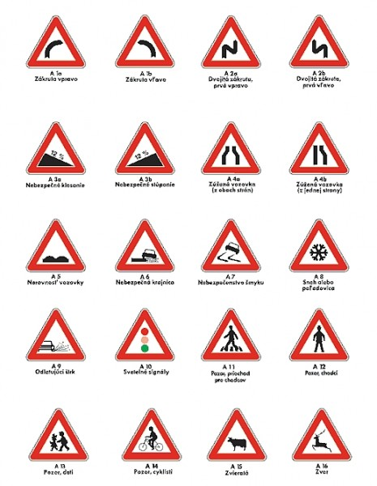

# Znacky

## Zvisle a vodorovne dop. znacky
- zvisle - na stlpiku
- vodorovne - nakreslene na zemi
- ak je nesulad medzi nimi tak **ZVISLE SU NADRADENE VODOROVNYM**
## Dop. znacky a dop. zariadenia
- svetelne signaly su nadriadene dopravnym znackam
## Hierarchia toho co plati
1. policajt
2. svetelne signaly
3. zvisle dopravne znacky
4. vodorovne dopravne znacky

Dopravne znacky upravujuce **zastavenie alebo statie** sa umiestnuju na tej strane na ktoru sa vztahuju

Neplati to pre jednosmerne cesty. Na nich sa taketo znacky mozu umiestnit na oboch stranach. 

Zakazove a prikazove znacky sa umiestnuju nad jazdny pruh na ktory sa vztahuju.

Zvisle dopravne znacky:
- trvale s premennym symbolom - napr. tie na dialniciach - zmeni sa znacka podla situacie
- trvale
- prenosne
Zvisle prenosne znacky su umiestnene na cerveno-bielom stlpiku alebo na aute dopravnej sluzby
Premenne znacky su nadradene trvalim
## Zakaz, obmedzenie alebo prikaz zo znacky

sa konci na vzidalenejsej hranici najblizsej krizovatky, ak nie je skor oznaceny inak
- od 1. aprila 2024 musia byt tieto znacky byt ukoncene
## Vodorovne trvale dopravne znacky

- zelene, zlte, ... ciary - cyklisti zelena
- prerusovane - zakaz statia
- plne - zakaz zastavenia aj statia 
- od 1. aprila koncia zlte ciary
### Stredova ciara
- 1 plna - zakaz predbiehania - mozem odbocit
- 2 plne - zakaz aj odbocenia
### Docasna vodorovna znacka
- oranzova 
- je nadradena trvalej vodorovnej znacke

# Testik - poznamky

- Pri vleceni vozidla rychlost max 60kmh
- pri cuvani s jednonapravovym privesom sa prives otaca na opacnu stranu ako tazne vozidlo
- pri odbocovani obmedzit mozes, ohrozit nie
- tyc - cerveno biele pruhy 7.5cm, lano ma cervenu vlajocku
- Regeneriaciu DPf - filtra pevnych castic u naftovych vozidiel zabezpecime ustalenou jazdou vyssou rychlostou aspon 10 min
- vyhrievanie sedadiel a zadneho skla ma vysoku spotrebu
- stlacanie spojky je rychle a pustanie pomalsie
- pri rozjazde z hladiska uspornej jazdy - svizne akcelerovat !!!!!!!!!!!!!!!! Zla odopoved - test je napicu
- pri preradeni kazdeho prevodoveho stupna postupne uvolnujeme a v zaberovom pasme pohyb spomalime
# ... Znacky

- Vystrazne

!! Niektore znacky tu ^ su zrkadlovo otocene takze:

### Znacka Krizovatka 
- treba si vsimat aj dodatkovu znacku pod nou.
### Navesti pred priecestim
- 1 ciara - 80m do zeleznicneho priecestia
- 2 - 160m 
- 3 - 240m
50 m pred priecestim musis mat stanovenu rychlost

## Regulacne Znacky
### Stopka
- zastavit na mieste na ktorom mam na krizovatku nalezity rozhlad
- a na stop ciare

Najvyssiu povolenu rychlost nemozem porusit ani pri predbiehani.

## Informacne

### Obytna zona
- max 20kmh
- deti sa mozu hrat vsade ci co
- statie len na vyhradenych miestach
- ked vychadzam z obytnej zony musim dat prednost vsetkym vozidlam (vratane cyklistov)
### Skolska Zona
- max 20kmh
- byva len pri zakladnych skolach